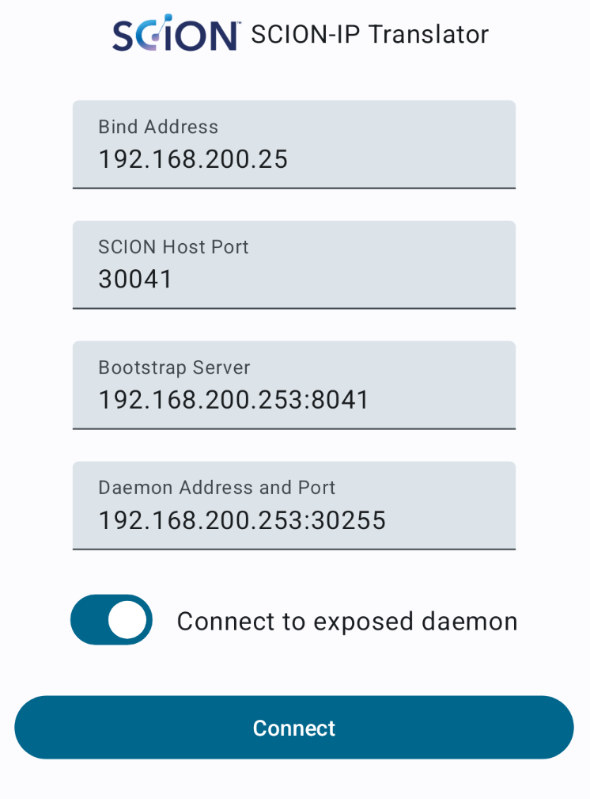

SCION-IP Translator for Android PoC
===================================

Based on [ToyVpn] sample using [Android VPN service] to create the TUN interface.

Uses [JPAN] for packet parsing and to connect to a SCION daemon.

[ToyVpn]: https://android.googlesource.com/platform/development/+/refs/heads/main/samples/ToyVpn?autodive=0%2F
[Android VPN service]: https://developer.android.com/develop/connectivity/vpn#service
[JPAN]: https://github.com/scionproto-contrib/jpan


---

TODO:
- Configuration UI (current UI is just decoration)
- Error handling
- Reflect translator state in UI
- Configure routes properly, don't block non-SCION traffic
- Improve performance
- Validate packets properly
- Path MTU management
- Path selectors
- Path monitoring and policy UI
- Handling of ICMP and SCMP
- Support for dispatcherless border router

Demo
----
This demo requires an Android device and a Linux host connected to the same LAN. Configure a SCION
development environment on the Linux machine and run a SCION topology as outlined below. The
topology consists of three AS. We create two network namespaces representing a host in AS 0:0:fc00
and AS 0:0:fc02, respectively. The Android device will be part of AS 0:0:fc01. In order for the
Android device to connect, the configuration of AS 0:0:fc01 is changed to expose the control
service, border router, and a SCION daemon on the LAN. In order for the translator to pick up the
AS, the hard coded addresses in `ScionTranslatorService.java:50` must be set the the correct values
before the app is deployed on the device (the configuration UI doesn't work). Instead of connecting
directly to an exposed daemon, it is possible to configure a bootstrapping server. To use a
bootstrapping server, set `mConnectToDaemon` to false and set `mBootstrapServer` to the correct
servers's address. JPAN's bootstrapping feature currently only works with SCION v0.10.0. The rest
of the code has been tested with v0.11.0 as well.

Prepare the host system as follows. Replace `192.168.200.253` with the IP address of your system
that the Android device will connect to.
```bash
sudo demo/setup.py
cd SCION_ROOT
rm -r gen gen-cache traces logs
./scion.sh topology -c <...>/demo/topology.topo
cp -r gen/AS64512/* gen/AS0_0_fc00/
cp -r gen/AS64513/* gen/AS0_0_fc01/
cp -r gen/AS64514/* gen/AS0_0_fc02/
jq '.control_service["cs1-0_0_fc00-1"].addr |= sub("\\[(.*)\\]"; "10.128.0.2") |
    .discovery_service["cs1-0_0_fc00-1"].addr |= sub("\\[(.*)\\]"; "10.128.0.2") |
    .border_routers["br1-0_0_fc00-1"].internal_addr |= sub("\\[(.*)\\]"; "10.128.0.2")' \
    gen/AS0_0_fc00/topology.json | sponge gen/AS0_0_fc00/topology.json
sed -iE 's/"\[.*\]/"10.128.0.2/' gen/AS0_0_fc00/sd.toml
jq '.control_service["cs1-0_0_fc01-1"].addr |= sub("\\[(.*)\\]"; "192.168.200.253") |
    .discovery_service["cs1-0_0_fc01-1"].addr |= sub("\\[(.*)\\]"; "192.168.200.253") |
    .border_routers["br1-0_0_fc01-1"].internal_addr |= sub("\\[(.*)\\]"; "192.168.200.253")' \
    gen/AS0_0_fc01/topology.json | sponge gen/AS0_0_fc01/topology.json
sed -iE 's/"\[.*\]/"192.168.200.253/' gen/AS0_0_fc01/sd.toml
jq '.control_service["cs1-0_0_fc02-1"].addr |= sub("\\[(.*)\\]"; "[fc00:10fc:200::2]") |
    .discovery_service["cs1-0_0_fc02-1"].addr |= sub("\\[(.*)\\]"; "[fc00:10fc:200::2]") |
    .border_routers["br1-0_0_fc02-1"].internal_addr |= sub("\\[(.*)\\]"; "[fc00:10fc:200::2]")' \
    gen/AS0_0_fc02/topology.json | sponge gen/AS0_0_fc02/topology.json
sed -iE 's/"\[.*\]/"10.128.2.2/' gen/AS0_0_fc02/sd.toml
./scion.sh run
```

Clone the [scion-ip-translator](https://github.com/netsys-lab/scion-ip-translator) repository and
run some translators and http servers in two of the ASes:
```bash
cd scion-ip-translator
sudo -E env PATH=$PATH PYTHONPATH=../scapy-scion-int ip netns exec host0 ./scitun.py 10.128.0.1 veth0 -d 10.128.0.2:30255
sudo -E env PATH=$PATH PYTHONPATH=../scapy-scion-int ip netns exec host2 ./scitun.py fc00:10fc:200::1/64 veth4 -d 10.128.2.2:30255
sudo ip netns exec host0 ip link set dev scitun mtu 1280
sudo ip netns exec host2 ip link set dev scitun mtu 1280
(cd demo && sudo ip netns exec host0 python -m http.server --bind fc00:10fc::ffff:a80:1 80)
(cd demo && sudo ip netns exec host2 python -m http.server --bind fc00:10fc:200::1 80)
```

(Optional) Run a SCION end host bootstrap server:
```bash
cd scion-ip-translator/bootstrap-server
./bootstrap-server.py ${SCION_ROOT}/gen/AS0_0_fc01 192.168.200.253 8041
```

Build the app (make sure you have hard coded the correct addresses) and run it on the Android
device. When you push the connect button, a toast saying "SCION-IP Translator connecting", shortly
followed by "SCION-IP Translator connected", should appear on screen. Open a web browser and
navigate to `http://[fc00:10fc:200::1]` or `http://[fc00:10fc:200::1]`.

When done, stop servers, translators and SCION. Delete network namespaces with:
```bash
sudo ip netns delete host0
sudo ip netns delete host2
```
